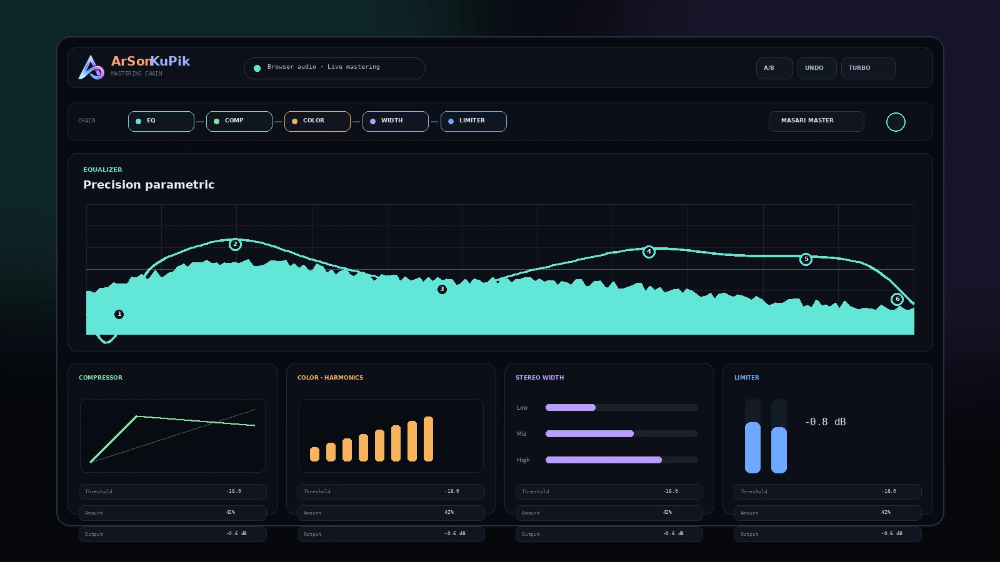

<div align="center">
  
  <h1>ArSonKuPik</h1>
  <p><strong>Professional browser audio mastering, processed locally.</strong></p>
  <p>
    <a href="https://masarray.github.io/arsonkupik-extension/"></a>
    <a href="https://github.com/masarray/arsonkupik-extension/releases"></a>
    
    
  </p>
</div>



ArSonKuPik is a privacy-first Chrome extension that transforms browser playback into a controllable mastering chain. It combines precision parametric EQ, stereo-linked dynamics, harmonic color, multiband width control, true-peak-oriented limiting, output routing, and carefully voiced listening presets in one compact studio interface.

> Audio stays inside the browser. The extension has no host permissions, analytics, telemetry, account system, or cloud audio upload.

## Highlights

- **Precision EQ** — interactive parametric bands, filter slopes, solo/bypass behavior, and real-time spectrum views.
- **Controlled dynamics** — stereo-linked compression with visible gain reduction and practical listening presets.
- **Harmonic color** — adjustable body, presence, air, and saturation designed for long listening sessions.
- **Phase-aware width** — multiband stereo shaping with correlation feedback and a stable center image.
- **Output safety** — gain staging, limiter protection, clipping feedback, and output-device routing where supported.
- **Fast workflow** — master and module presets, A/B comparison, undo/redo, custom local presets, ECO/TURBO processing modes.
- **Privacy by design** — active-tab capture only after user action; local processing and local settings storage.

## Install for development

1. Download or clone this repository.
2. Open `chrome://extensions` in a Chromium-based browser.
3. Enable **Developer mode**.
4. Select **Load unpacked** and choose the repository root.
5. Open a tab that is playing audio, click the ArSonKuPik icon, then select **Start Enhance**.

```bash
git clone https://github.com/masarray/arsonkupik-extension.git
cd arsonkupik-extension
npm run check
```

Chrome 116 or newer is required by the current manifest.

## Build a clean extension ZIP

```bash
npm run package
```

The release archive is created in `dist/` and includes only Chrome Web Store runtime files. Documentation, repository metadata, development scripts, and local-only files are excluded.

## Architecture

```text
Active browser tab
        │
        ▼
chrome.tabCapture
        │
        ▼
Offscreen document + Web Audio graph
        │
        ├── Parametric EQ
        ├── Stereo compressor
        ├── Harmonic color
        ├── Multiband width
        └── Output gain + limiter
        │
        ▼
System default or selected output device
```

| Area | Responsibility |
|---|---|
| `src/background/` | Extension lifecycle, tab capture orchestration, persistent state, studio-tab management |
| `src/offscreen/` | Web Audio graph, meters, spectrum analysis, DSP execution, output routing |
| `src/popup/` | Lightweight start/stop, preset, and output-device controls |
| `src/studio/` | Full mastering UI and visualization layer |
| `src/shared/` | Presets, messaging, device helpers, and spectrum utilities |
| `docs/` | GitHub Pages landing site, privacy policy, support pages, and SEO assets |
| `scripts/` | Repository validation and deterministic Web Store packaging |

See [ARCHITECTURE.md](ARCHITECTURE.md) for the detailed runtime flow. Chrome Web Store privacy declarations are tracked in [CHROME_WEB_STORE_PRIVACY_DISCLOSURE.md](CHROME_WEB_STORE_PRIVACY_DISCLOSURE.md).

## Permissions

| Permission | Purpose |
|---|---|
| `activeTab` | Limits user-triggered interaction to the currently selected tab |
| `tabCapture` | Captures audio from the tab selected by the user |
| `offscreen` | Keeps the Web Audio processing graph alive outside the popup |
| `storage` | Saves settings, presets, consent, output routes, and per-domain preferences locally |

ArSonKuPik declares **no host permissions**, does not request microphone access, and uses the browser's user-initiated speaker chooser only when supported. Full explanations are provided in [PRIVACY.md](PRIVACY.md) and [docs/privacy.html](docs/privacy.html).

## Quality checks

```bash
npm run check
npm run release:check
```

The validator checks JSON integrity, required runtime files, referenced local assets, version alignment, forbidden remote runtime code, privacy hardening, and release metadata. A Node-based smoke test verifies consent gating, per-site deletion, and total local-data reset. GitHub Actions runs these checks on pushes and pull requests. The completed privacy-hardening evidence is recorded in [RELEASE_AUDIT_0.3.101.md](RELEASE_AUDIT_0.3.101.md), and the Indonesia-first support implementation is recorded in [RELEASE_AUDIT_0.3.102.md](RELEASE_AUDIT_0.3.102.md).

## Project status

ArSonKuPik is under active development. The repository currently tracks the `0.3.102` privacy-hardened engine and Indonesia-first voluntary-support interface line. Review [CHANGELOG.md](CHANGELOG.md) and [ROADMAP.md](ROADMAP.md) before integrating experimental branches.

## Support development

ArSonKuPik remains free to use. Indonesian users can optionally support independent development from the public [QRIS support page](https://masarray.github.io/arsonkupik-extension/id/dukung.html). The link is user-initiated, contains no analytics or payment SDK, and never unlocks or restricts core features. QRIS deployment instructions are documented in [QRIS_SETUP.md](QRIS_SETUP.md).

## Contributing and security

Read [CONTRIBUTING.md](CONTRIBUTING.md) and the [Contributor License Agreement](CONTRIBUTOR_LICENSE_AGREEMENT.md) before opening a pull request. Please report security or privacy concerns privately using the process in [SECURITY.md](SECURITY.md), not through a public issue.

## License

Copyright © 2026 Mas Ari. All rights reserved. This is source-available software, not an open-source license. See [LICENSE](LICENSE).
